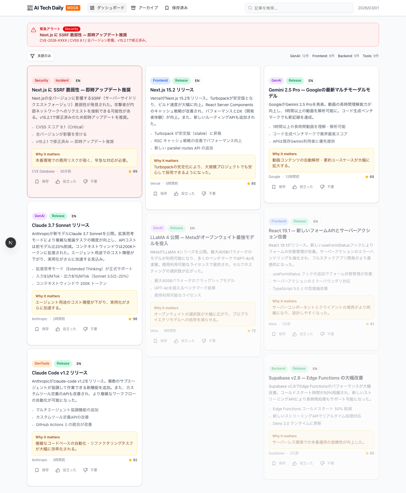
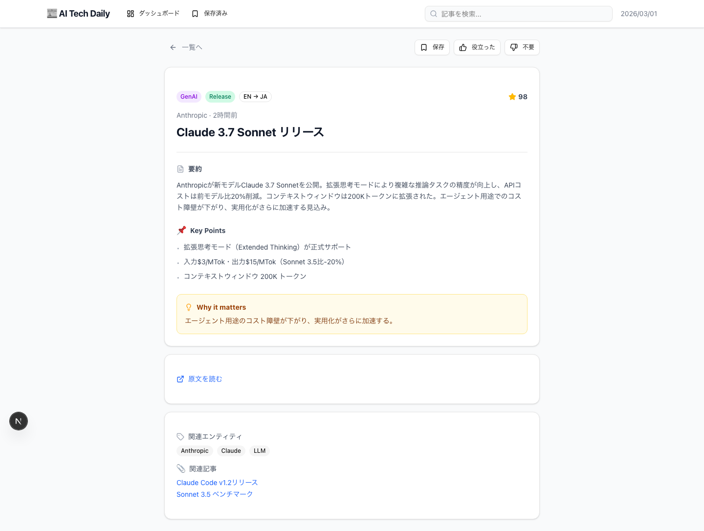
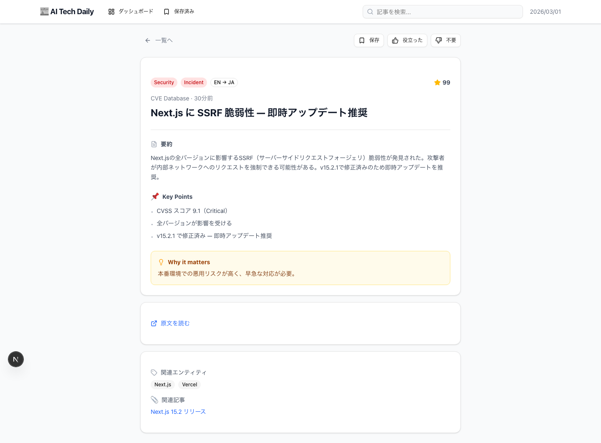
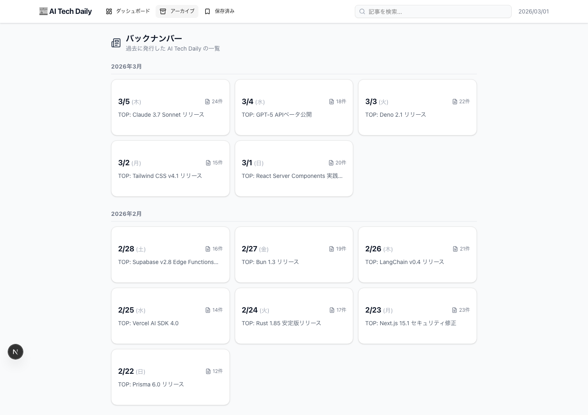
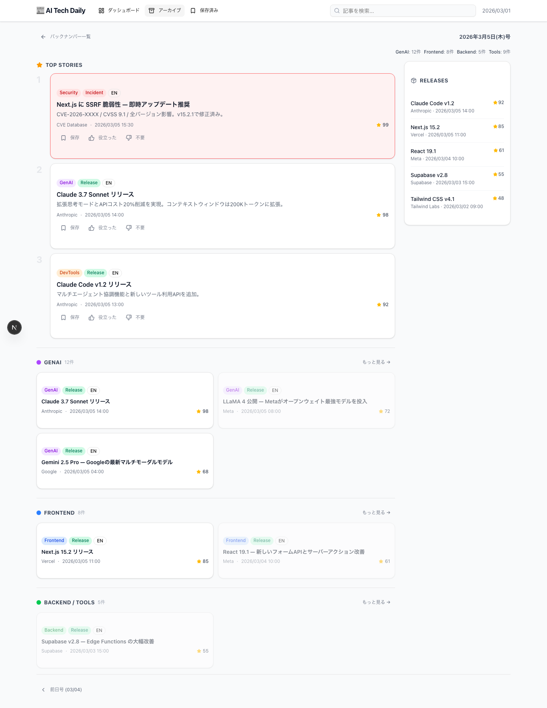
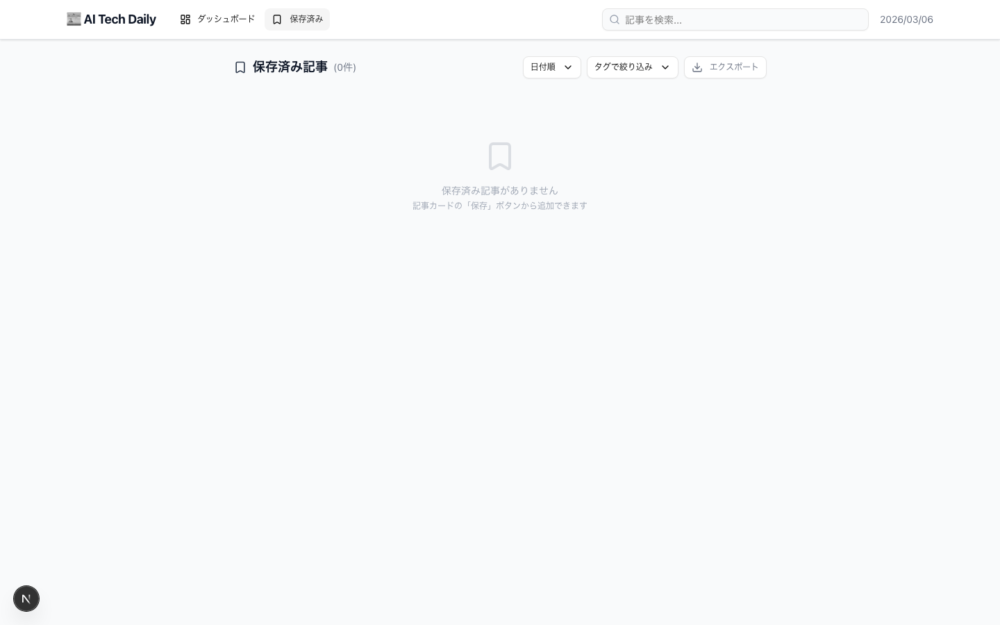
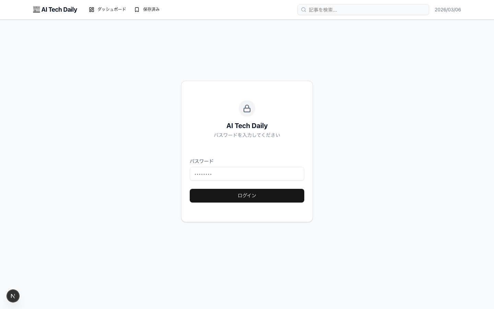

# UI 画面設計書 — AI Tech Daily

対応仕様書: `ai_tech_daily_aggregator_prd_v_2.md`

モックアップ実装: `mock/` ディレクトリ（Next.js + Tailwind CSS + shadcn/ui）

---

## 画面一覧

| 画面 | URL | 説明 |
|---|---|---|
| ダッシュボード（一面） | `/` | 最新号の情報閲覧画面（今日の一面） |
| アーカイブ一覧 | `/archives` | 過去のバックナンバー一覧 |
| アーカイブ日付別 | `/archives/[date]` | 特定日のスナップショット（SSG静的生成） |
| 記事詳細 | `/items/[id]` | 要約・Key Points・Why it matters |
| 記事詳細（緊急） | `/items/[id]` | Security/Incidentカテゴリの表示例 |
| あとで読む | `/saved` | あとで読む記事の管理画面 |
| ログイン | `/login` | パスワード保護画面 |

---

## 1. ヘッダー（共通）

全画面に共通して表示される固定ナビゲーションバー。

**構成要素:**
- ロゴ「📰 AI Tech Daily」（クリックでダッシュボードへ）
- ナビゲーション: ダッシュボード / アーカイブ / あとで読む（現在地をハイライト）
- 全文検索ボックス
- 現在日付（右端）

**レスポンシブ対応:**
- **モバイル（< `md:` 768px）:** ハンバーガーメニューを表示し、ナビゲーションリンクはドロワー内に格納。ロゴは省略表示（アイコンのみ）。日付は非表示。各メニュー項目は `h-11`（44px）のタッチターゲットを確保。
- **タブレット・デスクトップ（>= `md:` 768px）:** 従来のインラインナビゲーションを表示。

---

## 2. ダッシュボード（一面 = 最新号）



ダッシュボード（`/`）は常に**最新号（今日の一面）**を表示する。日付が変わると前日分は自動的にアーカイブとして保存される（詳細は「アーカイブ」セクション参照）。

### レイアウト概要

重要度スコア降順に全記事を **MasonryGrid（Masonry レイアウト）** で表示する。`lg:` 以上で3カラム、`sm:` で2カラム、モバイルで1カラムに変化する。

```
┌──────────────────────────────────────────────────────┐
│ [緊急アラートバナー]（緊急記事がある場合のみ）              │
├──────────────────────────────────────────────────────┤
│ [フィルターバー] 未読のみ | カテゴリ件数サマリー           │
├──────────────────────────────────────────────────────┤
│  [記事カード]    [記事カード]    [記事カード]             │
│  ─────────────  ─────────────  ─────────────         │
│  [記事カード]    [記事カード]    [記事カード]             │
│  （高さが違うカードが隙間なく並ぶMasonryレイアウト）        │
└──────────────────────────────────────────────────────┘
```

### 緊急アラートバナー（UrgentAlertBanner コンポーネント）

`is_urgent = true` の記事が存在する場合、フィルターバーの上に赤いバナーを表示する。バナー全体がクリッカブルで記事詳細へ遷移する。

- 背景: 赤系（`bg-red-50` / `border-red-300`）
- アイコン: ⚠ AlertTriangle
- 情報: 「緊急アラート」ラベル + Securityバッジ + タイトル + 短い要約

### フィルターバー

- **「未読のみ」ボタン**: 既読記事（`isRead: true`）を非表示にするトグル
- **カテゴリ件数サマリー**（右寄せ）: `GenAI: 12件 | Frontend: 8件 | Backend: 5件 | Tools: 9件`

### MasonryGrid コンポーネント

`frontend/components/MasonryGrid.tsx` / `mock/components/MasonryGrid.tsx` として実装。

- 記事を重要度スコア降順で受け取り、Masonry レイアウトで配置する
- 各カラムに記事を上から順に割り当てる（高さが均等になるよう調整）
- 各記事カードは展開トグル付きで、クリックでサマリー・Key Points・Why it matters を展開表示できる

---

## 3. 記事カード

記事一覧で使用するカードコンポーネント。フルサイズとコンパクトの2種類がある。

### フルカード（MasonryGrid で使用）

```
┌──────────────────────────────────────────┐
│ [GenAI][Release][EN]        [あとで読む] │
│ タイトル（太字）                           │
│ ソース名 · 公開日時              スコア数値 │
│ ▼（展開ボタン）                           │
├──────────────────────────────────────────┤
│（展開時）                                 │
│ 短い要約テキスト                           │
│ Key Points:                              │
│ · keyPoints[0]                           │
│ · keyPoints[1]                           │
│ Why it matters:                          │
│ whyItMatters テキスト                     │
└──────────────────────────────────────────┘
```

**展開トグル:**
- 記事カードをクリックすると詳細（サマリー・Key Points・Why it matters）を展開表示
- ChevronDown / ChevronUp アイコンで開閉状態を示す
- デフォルトは折りたたみ状態（`expanded` prop で初期展開も可）

**あとで読みボタン:**
- 右上に Clock アイコンのボタンを表示
- `toggleSave` Server Action でトグル保存
- 保存済みの場合は Check アイコン（緑色）に変化

**スコア表示（ScoreBadge コンポーネント）:**
- DB 上の `importanceScore`（0〜1 の小数）を 0〜100 の整数にスケーリングして表示
- `frontend/components/ScoreBadge.tsx` として実装

### コンパクトカード

フルカードから展開エリアを省いたシンプル版。compact prop で切り替え。

### ラベルの色定義

**topicラベル:**

| 値 | 表示名 | 色 |
|---|---|---|
| genai | GenAI | 紫（bg-purple-100 / text-purple-700） |
| frontend | Frontend | 青（bg-blue-100 / text-blue-700） |
| backend | Backend | 緑（bg-green-100 / text-green-700） |
| devtools | DevTools | オレンジ（bg-orange-100 / text-orange-700） |
| security | Security | 赤（bg-red-100 / text-red-700） |

**formatラベル:**

| 値 | 表示名 | 色 |
|---|---|---|
| release | Release | 薄緑（bg-emerald-100 / text-emerald-700） |
| tutorial | Tutorial | 薄青（bg-sky-100 / text-sky-700） |
| benchmark | Benchmark | 薄黄（bg-amber-100 / text-amber-700） |
| incident | Incident | 赤（bg-red-100 / text-red-700） |
| announcement | Announcement | 薄紫（bg-violet-100 / text-violet-700） |

### 既読記事の表示

`isRead: true` の記事カードは透明度50%（`opacity-50`）でグレーアウト表示する。

### 緊急記事カードの表示

`is_urgent: true` の記事カードは赤系のボーダーと背景色（`border-red-400 bg-red-50`）で強調する。

---

## 4. 記事詳細画面

### 通常記事の場合



### 緊急・セキュリティ記事の場合



### レイアウト概要

最大幅 `max-w-3xl`（中央寄せ）の縦一列レイアウト。

```
┌──────────────────────────────────┐
│ ← 一覧へ    [保存] [役立った] [不要] │
├──────────────────────────────────┤
│ [topicラベル][formatラベル][EN→JA] ★99 │
│ ソース名 · 公開日時                 │
│ タイトル（h1 / 太字大）              │
│ ─────────────────────────────── │
│ 📄 要約                           │
│ （summaryMedium: 3〜5行）          │
│                                  │
│ 📌 Key Points                    │
│ • keyPoints[0]                   │
│ • keyPoints[1]                   │
│ • keyPoints[2]                   │
│                                  │
│ 💡 Why it matters（黄色背景）      │
│ whyItMatters テキスト              │
├──────────────────────────────────┤
│ 🔗 原文を読む                      │
├──────────────────────────────────┤
│ 🏷 関連エンティティ: [Badge]...    │
│ 📎 関連記事: テキストリンク...      │
└──────────────────────────────────┘
```

### 各セクションの詳細

| セクション | 内容 | データソース |
|---|---|---|
| ヘッダー | ラベル群・スコア・ソース・日時・タイトル | `item` テーブル |
| 要約 | 3〜5行の詳細要約 | `item.summary_medium` |
| Key Points | 箇条書き3項目 | `item.key_points` |
| Why it matters | 重要性の理由（黄色背景カード） | `item.why_it_matters` |
| 原文リンク | 外部リンク（新しいタブで開く） | `item.url` |
| 関連エンティティ | ライブラリ・企業・モデル名のバッジ | `item_entity` テーブル |
| 関連記事 | 関連記事タイトルのリンクリスト | 意味的類似度で紐付け |

### フィードバックアクション

ページ右上に常時表示するボタン:
- **あとで読む**（Clock アイコン）: `saved_item` テーブルに追加（ReadLaterButton コンポーネント）。保存済みの場合は Check アイコン（緑）に変化。

---

## 5. アーカイブ画面（バックナンバー）

新聞のバックナンバーとして、過去に発行した日ごとのダッシュボードスナップショットを閲覧できる。

### 5.1 アーカイブ一覧（`/archives`）



発行済みの全バックナンバーを月別にグループ化して表示する。

```
┌──────────────────────────────────────────┐
│ 📰 バックナンバー                          │
│ 過去に発行した AI Tech Daily の一覧        │
├──────────────────────────────────────────┤
│                                          │
│ 2026年3月 ─────────────────────────────  │
│ ┌──────────────────────────────────────┐ │
│ │ 3/5(木)                    📄 24件  │ │
│ │ ・Claude 4.5 Opus リリース ...       │ │
│ │ ・Next.js 17 RC 発表 ...            │ │
│ │ ・React Server Actions 改善 ...     │ │
│ │ ...（最大10件）                       │ │
│ └──────────────────────────────────────┘ │
│ ┌──────────────────────────────────────┐ │
│ │ 3/4(水)                    📄 18件  │ │
│ │ ・...                               │ │
│ └──────────────────────────────────────┘ │
│                                          │
└──────────────────────────────────────────┘
```

**各日付カード:**
- 日付（曜日付き）
- 記事件数
- 重要度順 TOP 10 記事のタイトル一覧（各行 truncate）
- クリックで `/archives/[date]` へ遷移

**レイアウト:** 最大幅 `max-w-4xl`（中央寄せ）、1カラムリスト

### 5.2 アーカイブ日付別（`/archives/[date]`）



特定日のダッシュボードスナップショットを表示する。レイアウトはダッシュボード（一面）と同一構造。

```
┌──────────────────────────────────────────┐
│ ← バックナンバー一覧    2026年3月5日(木)号 │
├──────────────────────────────────────────┤
│                                          │
│  （ダッシュボードと同一のレイアウト）       │
│  緊急アラートバナー / フィルターバー /      │
│  TOP STORIES / カテゴリセクション /        │
│  Releases サイドバー                      │
│                                          │
├──────────────────────────────────────────┤
│ ← 前日号 (3/4)          次日号 (3/6) →   │
└──────────────────────────────────────────┘
```

**ダッシュボードとの差分:**
- ヘッダーに「← バックナンバー一覧」リンクと発行日を表示
- フッターに前日号・次日号へのページネーション
- フィルターバーの「未読のみ」トグルは非表示（アーカイブは既読管理対象外）
- **時刻表示は絶対時刻**（例: `2026/03/05 14:00`）を使用する。ダッシュボード（最新号）では相対時刻（「2時間前」等）だが、アーカイブは SSG で静的化されるため相対時刻は不適切
- フィードバックアクション（保存・役立った・不要）は引き続き利用可能

### 5.3 SSG（静的サイト生成）方針

アーカイブは**日刊発行 → 静的ファイル化**の運用とする。

| 項目 | 内容 |
|---|---|
| 生成タイミング | 毎日のビルド時（GitHub Actions の daily ビルドジョブ） |
| 生成方式 | Next.js `generateStaticParams` によるSSG |
| URLパターン | `/archives/YYYY-MM-DD`（例: `/archives/2026-03-05`） |
| データソース | ビルド時に DB から該当日の item を取得し、静的HTMLとして出力 |
| 増分ビルド | 新しい日付のページのみ生成（過去分は再生成しない） |
| ダッシュボード（`/`） | ISR or SSR で常に最新データを表示（静的化しない） |

**ビルドフロー:**

```
[毎日のビルドジョブ（GitHub Actions）]
  │
  ├── 1. 前日分のアーカイブページを SSG で生成
  │      generateStaticParams() → ["/archives/2026-03-05"]
  │      DB から前日の item を取得 → 静的HTML出力
  │
  ├── 2. アーカイブ一覧ページを再生成
  │      全発行日のリストを取得 → 静的HTML出力
  │
  └── 3. Vercel にデプロイ
```

---

## 6. あとで読む画面



### レイアウト概要

最大幅 `max-w-3xl`（中央寄せ）。記事を保存日付でグループ化して縦一列に表示する。

```
┌──────────────────────────────────────────┐
│ 🕐 あとで読む (4件)  [日付順▼][タグ絞込▼][エクスポート] │
├──────────────────────────────────────────┤
│ タグ: [llm] [api] [frontend] ...         │
├──────────────────────────────────────────┤
│ 2026/03/01 ───────────────────────────  │
│ ┌──────────────────────────────────────┐ │
│ │ タイトル                        [🗑] │ │
│ │ ソース · 日時                         │ │
│ │ [🏷 llm] [🏷 api] [タグ追加]         │ │
│ └──────────────────────────────────────┘ │
│ ┌──────────────────────────────────────┐ │
│ │ タイトル                        [🗑] │ │
│ └──────────────────────────────────────┘ │
│                                          │
│ 2026/02/28 ───────────────────────────  │
│  ...                                     │
└──────────────────────────────────────────┘
```

### ヘッダーコントロール

| コントロール | 動作 |
|---|---|
| 日付順 ▼ | 保存日時の昇順/降順を切り替え |
| タグで絞り込み ▼ | タグ選択でフィルタリング |
| エクスポート | Markdown形式でダウンロード（Phase 2） |

### タグフィルターチップ

ページ上部に全タグをチップ形式で並べ、クリックで絞り込みを行う。

### 記事カード内の操作

| 操作 | UI | 動作 |
|---|---|---|
| タイトルクリック | リンク | 記事詳細画面へ遷移 |
| タグ追加 | テキストボタン | タグ入力フォームを表示 |
| 削除 | ゴミ箱アイコン | 保存一覧から削除 |

---

## 7. ログイン画面



個人利用専用のパスワード保護画面。画面中央にシンプルなカードを配置する。

### 構成要素

- ロックアイコン（🔒）
- サービス名「AI Tech Daily」
- サブテキスト「パスワードを入力してください」
- パスワード入力フィールド
- ログインボタン（全幅）

### 認証方式

Vercel Password Protection または Basic認証を使用する（設定管理はサーバー側で実施、アプリ内に認証ロジックを持たない）。

---

## 8. モックアップの起動方法

```bash
cd mock
npm run dev
# → http://localhost:3000 でアクセス可能
```

| URL | 画面 |
|---|---|
| `http://localhost:3000/` | ダッシュボード（最新号） |
| `http://localhost:3000/archives` | アーカイブ一覧（バックナンバー） |
| `http://localhost:3000/archives/2026-03-05` | アーカイブ日付別（特定日のスナップショット） |
| `http://localhost:3000/items/1` | 記事詳細（通常記事） |
| `http://localhost:3000/items/7` | 記事詳細（緊急・Security記事） |
| `http://localhost:3000/saved` | あとで読む |
| `http://localhost:3000/login` | ログイン |

---

## 9. 技術スタック（モックアップ）

| 項目 | 技術 |
|---|---|
| フレームワーク | Next.js 16 (App Router) |
| UIライブラリ | shadcn/ui |
| スタイリング | Tailwind CSS v4 |
| アイコン | lucide-react |
| モックデータ | `mock/lib/mock-data.ts`（静的データ） |

---

---

## 10. レスポンシブデザイン方針

モバイルファーストで設計し、Tailwind CSS のブレークポイントで段階的にレイアウトを拡張する。

### ブレークポイント

| ブレークポイント | 幅 | 用途 |
|---|---|---|
| デフォルト | < 640px | モバイル（iPhone SE 375px〜） |
| `sm:` | >= 640px | 小型タブレット・大型スマホ |
| `md:` | >= 768px | タブレット（iPad 768px）・ヘッダーナビ切替 |
| `lg:` | >= 1024px | デスクトップ・2カラムレイアウト切替 |

### 主な対応内容

- **ヘッダー:** `md:` 未満でハンバーガーメニュー、`md:` 以上でインラインナビゲーション
- **ダッシュボード/アーカイブ:** `lg:` 未満で1カラム（サイドバーはコンテンツ下に配置）、`lg:` 以上で2カラム
- **カテゴリセクション:** `sm:` 以上で2カラムグリッド
- **フィルターバー:** `sm:` 未満で縦積み、`sm:` 以上で横並び
- **記事詳細・あとで読むページ:** ヘッダー部コントロールが `sm:` 未満で縦積み

### タッチターゲット

WCAG 推奨の最小タッチターゲット 44px に準拠:

- モバイルハンバーガーメニューの各項目: `h-11`（44px）
- 記事カードのアクションボタン: モバイル `h-11` / デスクトップ `h-8`
- あとで読むページのタグチップ: モバイル `min-h-[44px]` / デスクトップ通常サイズ

---

*画面スクリーンショットは `docs/screenshots/` に格納。モックアップの実装詳細は `mock/` ディレクトリを参照。*
