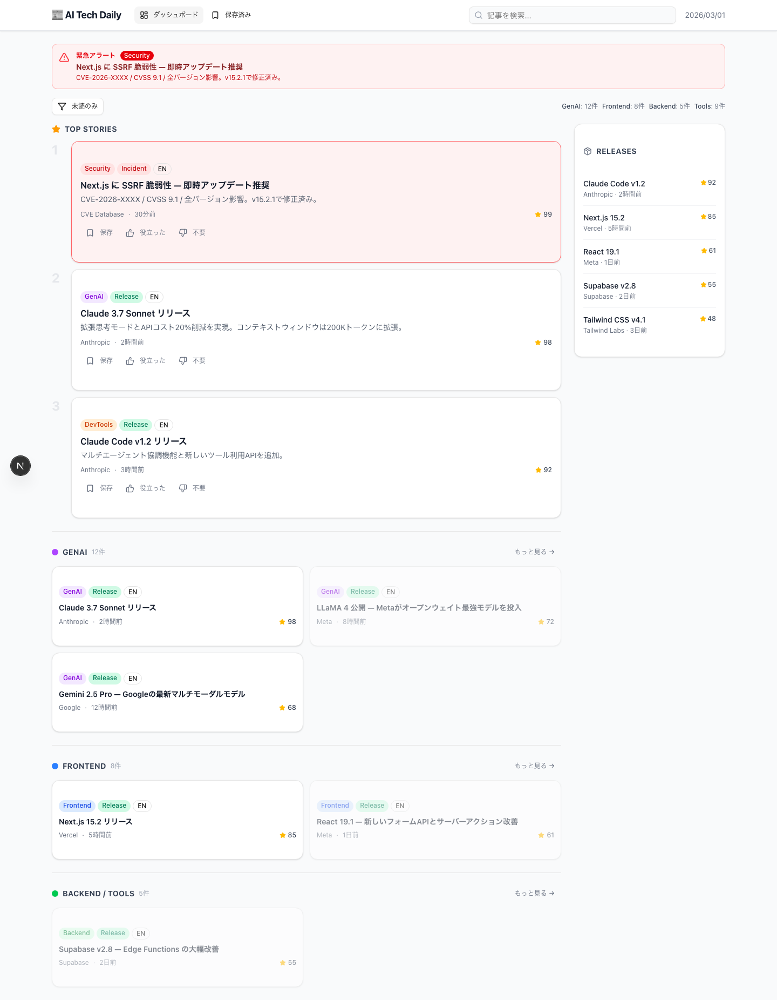

# UI 画面設計書 — AI Tech Daily

対応仕様書: `ai_tech_daily_aggregator_prd_v_2.md`

モックアップ実装: `mock/` ディレクトリ（Next.js + Tailwind CSS + shadcn/ui）

---

## 画面一覧

| 画面 | URL | 説明 |
|---|---|---|
| ダッシュボード（一面） | `/` | メインの情報閲覧画面 |
| 記事詳細 | `/items/[id]` | 要約・Key Points・Why it matters |
| 記事詳細（緊急） | `/items/[id]` | Security/Incidentカテゴリの表示例 |
| 保存一覧 | `/saved` | 保存済み記事の管理画面 |
| ログイン | `/login` | パスワード保護画面 |

---

## 1. ヘッダー（共通）

全画面に共通して表示される固定ナビゲーションバー。

**構成要素:**
- ロゴ「📰 AI Tech Daily」（クリックでダッシュボードへ）
- ナビゲーション: ダッシュボード / 保存済み（現在地をハイライト）
- 全文検索ボックス
- 現在日付（右端）

---

## 2. ダッシュボード（一面）



### レイアウト概要

画面を**左メインカラム + 右サイドバー（280px）**の2カラムで構成する。

```
┌──────────────────────────────────────┬────────────┐
│ [緊急アラートバナー]（緊急記事がある場合のみ）        │            │
├──────────────────────────────────────┤ RELEASES   │
│ [フィルターバー] 未読のみ | カテゴリ件数サマリー     │            │
├──────────────────────────────────────┤            │
│ ★ TOP STORIES                        │            │
│  1. [記事カード（フル）]               │            │
│  2. [記事カード（フル）]               │            │
│  3. [記事カード（フル）]               │            │
├──────────────────────────────────────┤            │
│ ● GENAI  12件          もっと見る →  │            │
│  [コンパクトカード] [コンパクトカード] │            │
│  [コンパクトカード] [コンパクトカード] │            │
├──────────────────────────────────────┤            │
│ ● FRONTEND  8件        もっと見る →  │            │
│  [コンパクトカード] [コンパクトカード] │            │
├──────────────────────────────────────┤            │
│ ● BACKEND / TOOLS  5件  もっと見る → │            │
│  [コンパクトカード]                    │            │
└──────────────────────────────────────┴────────────┘
```

### 緊急アラートバナー

`is_urgent = true` の記事が存在する場合、フィルターバーの上に赤いバナーを表示する。バナー全体がクリッカブルで記事詳細へ遷移する。

- 背景: 赤系（`bg-red-50` / `border-red-300`）
- アイコン: ⚠ AlertTriangle
- 情報: 「緊急アラート」ラベル + Securityバッジ + タイトル + 短い要約

### フィルターバー

- **「未読のみ」ボタン**: 既読記事（`isRead: true`）を非表示にするトグル
- **カテゴリ件数サマリー**（右寄せ）: `GenAI: 12件 | Frontend: 8件 | Backend: 5件 | Tools: 9件`

### TOP STORIES セクション

重要度スコア上位3件を大きめのフルカードで表示する。左端に順位番号（1/2/3）を薄いグレーで表示。

### カテゴリセクション（GenAI / Frontend / Backend）

各カテゴリを見出し＋2カラムグリッドで表示する。見出し左端にカテゴリカラーのドット（●）と件数を付与。「もっと見る →」で全件表示へ。

| カテゴリ | ドット色 |
|---|---|
| GenAI | 紫（bg-purple-500） |
| Frontend | 青（bg-blue-500） |
| Backend / Tools | 緑（bg-green-500） |

### Releases サイドバー

スクロールに追従する（`sticky top-20`）リリース専用カラム。各エントリは:
- リリース名（太字）
- ソース名 · 公開日時
- 重要度スコア（★数値）

---

## 3. 記事カード

記事一覧で使用するカードコンポーネント。フルサイズとコンパクトの2種類がある。

### フルカード（Top Stories）

```
┌──────────────────────────────────────────┐
│ [GenAI][Release][EN]                      │
│ タイトル（太字）                           │
│ 短い要約テキスト（最大2行）                │
│ ソース名 · 公開日時              ★ スコア │
│ [保存] [役立った] [不要]                  │
└──────────────────────────────────────────┘
```

### コンパクトカード（カテゴリセクション）

フルカードからアクション行と要約テキストを省いた軽量版。2カラムグリッドで並べる。

### ラベルの色定義

**topicラベル:**

| 値 | 表示名 | 色 |
|---|---|---|
| genai | GenAI | 紫（bg-purple-100 / text-purple-700） |
| frontend | Frontend | 青（bg-blue-100 / text-blue-700） |
| backend | Backend | 緑（bg-green-100 / text-green-700） |
| devtools | DevTools | オレンジ（bg-orange-100 / text-orange-700） |
| security | Security | 赤（bg-red-100 / text-red-700） |

**formatラベル:**

| 値 | 表示名 | 色 |
|---|---|---|
| release | Release | 薄緑（bg-emerald-100 / text-emerald-700） |
| tutorial | Tutorial | 薄青（bg-sky-100 / text-sky-700） |
| benchmark | Benchmark | 薄黄（bg-amber-100 / text-amber-700） |
| incident | Incident | 赤（bg-red-100 / text-red-700） |
| announcement | Announcement | 薄紫（bg-violet-100 / text-violet-700） |

### 既読記事の表示

`isRead: true` の記事カードは透明度50%（`opacity-50`）でグレーアウト表示する。

### 緊急記事カードの表示

`is_urgent: true` の記事カードは赤系のボーダーと背景色（`border-red-400 bg-red-50`）で強調する。

---

## 4. 記事詳細画面

### 通常記事の場合


### 緊急・セキュリティ記事の場合


### レイアウト概要

最大幅 `max-w-3xl`（中央寄せ）の縦一列レイアウト。

```
┌──────────────────────────────────┐
│ ← 一覧へ    [保存] [役立った] [不要] │
├──────────────────────────────────┤
│ [topicラベル][formatラベル][EN→JA] ★99 │
│ ソース名 · 公開日時                 │
│ タイトル（h1 / 太字大）              │
│ ─────────────────────────────── │
│ 📄 要約                           │
│ （summaryMedium: 3〜5行）          │
│                                  │
│ 📌 Key Points                    │
│ • keyPoints[0]                   │
│ • keyPoints[1]                   │
│ • keyPoints[2]                   │
│                                  │
│ 💡 Why it matters（黄色背景）      │
│ whyItMatters テキスト              │
├──────────────────────────────────┤
│ 🔗 原文を読む                      │
├──────────────────────────────────┤
│ 🏷 関連エンティティ: [Badge]...    │
│ 📎 関連記事: テキストリンク...      │
└──────────────────────────────────┘
```

### 各セクションの詳細

| セクション | 内容 | データソース |
|---|---|---|
| ヘッダー | ラベル群・スコア・ソース・日時・タイトル | `item` テーブル |
| 要約 | 3〜5行の詳細要約 | `item.summary_medium` |
| Key Points | 箇条書き3項目 | `item.key_points` |
| Why it matters | 重要性の理由（黄色背景カード） | `item.why_it_matters` |
| 原文リンク | 外部リンク（新しいタブで開く） | `item.url` |
| 関連エンティティ | ライブラリ・企業・モデル名のバッジ | `item_entity` テーブル |
| 関連記事 | 関連記事タイトルのリンクリスト | 意味的類似度で紐付け |

### フィードバックアクション

ページ右上に常時表示する3つのボタン:
- **保存**（Bookmark アイコン）: `saved_item` テーブルに追加
- **役立った**（ThumbsUp アイコン）: `feedback` テーブルに `helpful` を記録
- **不要**（ThumbsDown アイコン）: `feedback` テーブルに `not_helpful` を記録

---

## 5. 保存一覧画面


### レイアウト概要

最大幅 `max-w-3xl`（中央寄せ）。記事を保存日付でグループ化して縦一列に表示する。

```
┌──────────────────────────────────────────┐
│ 🔖 保存済み記事 (4件)  [日付順▼][タグ絞込▼][エクスポート] │
├──────────────────────────────────────────┤
│ タグ: [llm] [api] [frontend] ...         │
├──────────────────────────────────────────┤
│ 2026/03/01 ───────────────────────────  │
│ ┌──────────────────────────────────────┐ │
│ │ タイトル                        [🗑] │ │
│ │ ソース · 日時                         │ │
│ │ [🏷 llm] [🏷 api] [タグ追加]         │ │
│ └──────────────────────────────────────┘ │
│ ┌──────────────────────────────────────┐ │
│ │ タイトル                        [🗑] │ │
│ └──────────────────────────────────────┘ │
│                                          │
│ 2026/02/28 ───────────────────────────  │
│  ...                                     │
└──────────────────────────────────────────┘
```

### ヘッダーコントロール

| コントロール | 動作 |
|---|---|
| 日付順 ▼ | 保存日時の昇順/降順を切り替え |
| タグで絞り込み ▼ | タグ選択でフィルタリング |
| エクスポート | Markdown形式でダウンロード（Phase 2） |

### タグフィルターチップ

ページ上部に全タグをチップ形式で並べ、クリックで絞り込みを行う。

### 記事カード内の操作

| 操作 | UI | 動作 |
|---|---|---|
| タイトルクリック | リンク | 記事詳細画面へ遷移 |
| タグ追加 | テキストボタン | タグ入力フォームを表示 |
| 削除 | ゴミ箱アイコン | 保存一覧から削除 |

---

## 6. ログイン画面


個人利用専用のパスワード保護画面。画面中央にシンプルなカードを配置する。

### 構成要素

- ロックアイコン（🔒）
- サービス名「AI Tech Daily」
- サブテキスト「パスワードを入力してください」
- パスワード入力フィールド
- ログインボタン（全幅）

### 認証方式

Vercel Password Protection または Basic認証を使用する（設定管理はサーバー側で実施、アプリ内に認証ロジックを持たない）。

---

## 7. モックアップの起動方法

```bash
cd mock
npm run dev
# → http://localhost:3000 でアクセス可能
```

| URL | 画面 |
|---|---|
| `http://localhost:3000/` | ダッシュボード（一面） |
| `http://localhost:3000/items/1` | 記事詳細（通常記事） |
| `http://localhost:3000/items/7` | 記事詳細（緊急・Security記事） |
| `http://localhost:3000/saved` | 保存一覧 |
| `http://localhost:3000/login` | ログイン |

---

## 8. 技術スタック（モックアップ）

| 項目 | 技術 |
|---|---|
| フレームワーク | Next.js 16 (App Router) |
| UIライブラリ | shadcn/ui |
| スタイリング | Tailwind CSS v4 |
| アイコン | lucide-react |
| モックデータ | `mock/lib/mock-data.ts`（静的データ） |

---

*画面スクリーンショットは `docs/screenshots/` に格納。モックアップの実装詳細は `mock/` ディレクトリを参照。*
